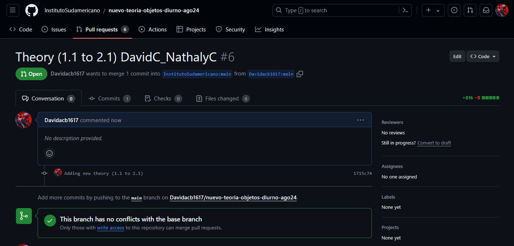

# CRUD en Prisma

### Nathaly Caballero: https://www.youtube.com/watch?v=TxPtvk-zrnQ

### David Correa: https://youtu.be/xjgjxeX1VOg

## 1. Introducción

Prisma es un ORM (Object-Relational Mapping) moderno para Node.js y TypeScript que facilita la gestión de bases de datos. Una de sus características más importantes es la capacidad de realizar operaciones CRUD (Crear, Leer, Actualizar, Eliminar) de manera eficiente y tipada, simplificando la interacción con la base de datos.

> **Reflexión**: ¿Cómo puede un ORM como Prisma mejorar la eficiencia y la seguridad en las operaciones CRUD en comparación con la escritura manual de consultas SQL?

## 2. Configuración Inicial

Antes de realizar operaciones CRUD, es necesario configurar Prisma en un proyecto. Esto incluye la instalación de dependencias y la inicialización de Prisma.

**Pasos para la configuración inicial:**

1. Crear un proyecto Node.js:

   ```bash
   mkdir my-prisma-crud
   cd my-prisma-crud
   npm init -y
   ```

2. Instalar Prisma y sus dependencias:

   ```bash
   npm install @prisma/client
   npm install prisma --save-dev
   ```

3. Inicializar Prisma:

   ```bash
   npx prisma init
   ```

4. Configurar el archivo `schema.prisma`:

   ```prisma
   datasource db {
     provider = "postgresql"
     url      = env("DATABASE_URL")
   }

   generator client {
     provider = "prisma-client-js"
   }

   model User {
     id    Int     @id @default(autoincrement())
     email String  @unique
     name  String?
   }
   ```

> **Reflexión**: La configuración inicial de Prisma establece una base sólida para la gestión de la base de datos. ¿De qué manera puede esto influir en la consistencia y la organización del código?

## 3. Operaciones CRUD

### Crear (Create)

Para crear un nuevo registro en la base de datos, se utiliza el método `create` del cliente Prisma. Este método acepta un objeto con los datos que se quieren insertar.

**Ejemplo:**

```typescript
import { PrismaClient } from '@prisma/client';
const prisma = new PrismaClient();

async function createUser() {
  const newUser = await prisma.user.create({
    data: {
      email: 'alice@example.com',
      name: 'Alice',
    },
  });
  console.log(newUser);
}

createUser();
```

> **Reflexión**: La operación de creación con Prisma es sencilla y directa. ¿Cómo puede esto mejorar la velocidad de desarrollo y reducir errores en comparación con las consultas SQL manuales?

### Leer (Read)

Para leer registros de la base de datos, se utilizan los métodos `findMany`, `findUnique`, entre otros. Estos métodos permiten recuperar datos según varios criterios.

**Ejemplo:**

```typescript
async function getUsers() {
  const users = await prisma.user.findMany();
  console.log(users);
}

getUsers();
```

> **Reflexión**: La capacidad de realizar consultas complejas de manera simple y tipada con Prisma puede mejorar la claridad y mantenibilidad del código. ¿Cómo puede esto facilitar la colaboración en equipos de desarrollo?

### Actualizar (Update)

Para actualizar un registro existente, se utiliza el método `update`. Este método requiere un criterio para encontrar el registro y los nuevos datos.

**Ejemplo:**

```typescript
async function updateUser() {
  const updatedUser = await prisma.user.update({
    where: { email: 'alice@example.com' },
    data: { name: 'Alice Wonderland' },
  });
  console.log(updatedUser);
}

updateUser();
```

> **Reflexión**: Las actualizaciones tipadas garantizan que los cambios en la base de datos sean consistentes y predecibles. ¿Cómo puede esto afectar la integridad de los datos en una aplicación?

### Eliminar (Delete)

Para eliminar un registro, se utiliza el método `delete`. Este método también requiere un criterio para identificar el registro a eliminar.

**Ejemplo:**

```typescript
async function deleteUser() {
  const deletedUser = await prisma.user.delete({
    where: { email: 'alice@example.com' },
  });
  console.log(deletedUser);
}

deleteUser();
```

> **Reflexión**: La eliminación segura y tipada de registros puede prevenir errores y asegurar la consistencia de la base de datos. ¿Cómo puede esto influir en la robustez y fiabilidad de una aplicación?

## Resumen

| Aspecto                 | Detalles                                                                            |
| ----------------------- | ----------------------------------------------------------------------------------- |
| **Crear (Create)**      | Uso del método `create` para insertar nuevos registros en la base de datos.         |
| **Leer (Read)**         | Uso de métodos como `findMany` y `findUnique` para recuperar datos según criterios. |
| **Actualizar (Update)** | Uso del método `update` para modificar registros existentes con datos nuevos.       |
| **Eliminar (Delete)**   | Uso del método `delete` para eliminar registros específicos de la base de datos.    |

Prisma simplifica las operaciones CRUD mediante un enfoque tipado y eficiente, mejorando la interacción con la base de datos y reduciendo errores comunes. Desde la configuración inicial hasta la ejecución de operaciones CRUD, Prisma ofrece una experiencia de desarrollo mejorada y más segura.

## Referencias

- Prisma Best Practices for Node.js Developers: A Comprehensive Guide. (s. f.). https://codeit.mk/home/blog/Prisma-Best-Practices-for-Node.js-Developers--A-Comprehensive-Guide
- Prisma | Simplify working and interacting with databases. (s. f.). Prisma. https://www.prisma.io/
- Pratama, P. P. (2023, 17 septiembre). Getting Started with Prisma ORM in Nest.js: A Comprehensive Guide. Medium. https://medium.com/google-developer-indonesia/getting-started-with-prisma-orm-in-nest-js-a-comprehensive-guide-787bdb65c02e

### Pull Request


